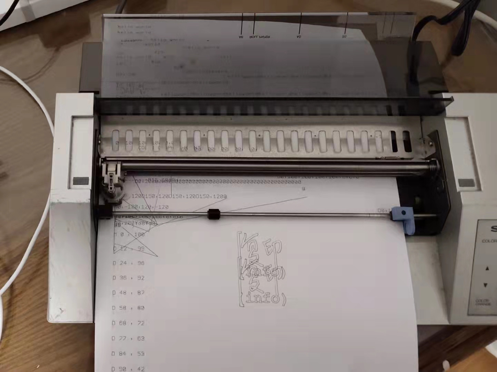

# A Plotting Workflow Based on Inkscape and the SHARP CE-515P Plotter

During the 2021 New Year holiday, comic artist Zijie provided an opportunity to collaborate with me on experimenting with two ALPS 4-pen plotters. We successfully set up the SHARP CE-515P plotter and the Fortec ET-318C typewriter/plotter, and completed a workflow from Inkscape output to the printer. The main code can be found here:
[https://github.com/pengan1987/dxy-plotter](https://github.com/pengan1987/dxy-plotter)

Both the SHARP CE-515P and Fortec ET-318C partially support Roland plotter’s DXY-GL plotting language. Since Inkscape only uses the PU/PD (pen up move, pen down move) commands when exporting HP-GL, which correspond to D/M in DXY-GL (I only have a single pen installed, so I didn’t consider pen-change commands), it’s relatively straightforward to convert HP-GL to DXY-GL for the ALPS 4-pen plotter mechanism.

In my experiments, the D/M commands on both the SHARP CE-515P and Fortec ET-318C only accept signed three-digit integers, meaning that the X and Y coordinate range is from -999 to 999. The machines will not accept commands like `M1000,1000`. To utilize the maximum plotting area, during initialization, I first move the pen to the center of the paper and then define that point as the origin.

This line in the source code performs that initialization—moving the pen and redefining the origin:
```python
printfile.write("\x1ba\r\n\x1bb\r\nM500,-500\r\nI\r\n")
```
So when exporting HP-GL files from Inkscape, you also need to make similar settings: set the center point as the origin and choose an appropriate DPI to avoid coordinates exceeding the supported range. In my testing, the CE-515P works well with 100 DPI, while the Fortec ET-318C is better suited for 200 DPI. You will see these center origin and DPI settings in the HP-GL export dialog in Inkscape.

You can use the script from the GitHub repo to convert HP-GL files to DXY-GL format. The output.txt file will contain the resulting DXY-GL command sequence:
```bash
python plot.py columbia.hpgl output.txt
```
Then you can send the DXY-GL command sequence to the printer port. My test environment used a Linux PC with a USB-to-parallel cable, and testing on Raspberry Pi also worked.
```bash
cat output.txt > /dev/usb/lp0
```
For convenience, you can also write directly to the printer port as the output file:
```bash
python plot.py columbia.hpgl /dev/usb/lp0
```

