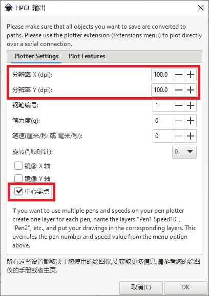
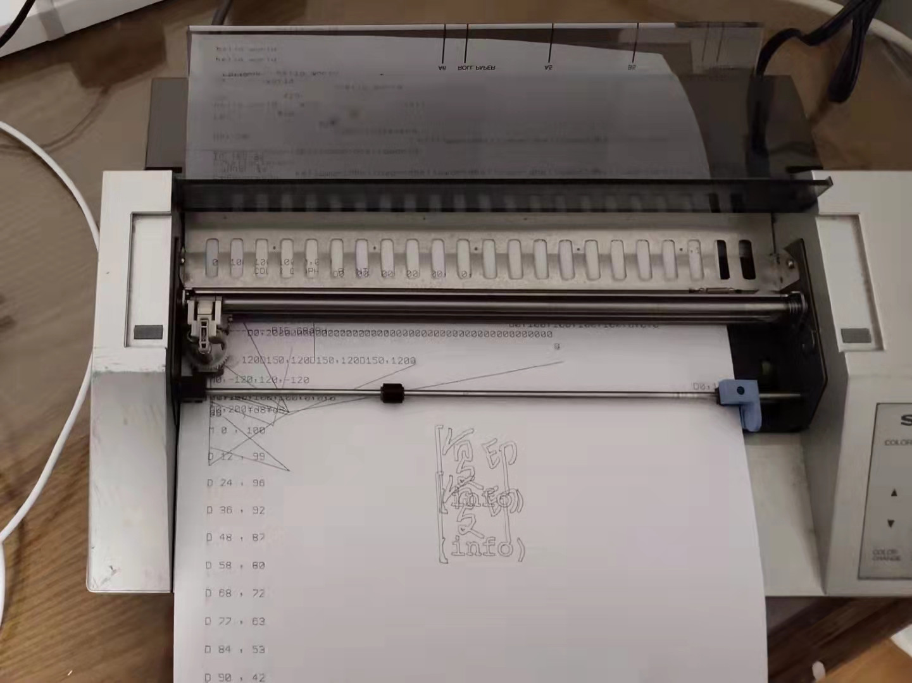

2021年新年假期，漫画家子杰提供了一个机会和我一起实验两款基于ALPS 4笔尖绘图仪的机会，我们调通了SHARP CE-515P绘图仪和Fortec ET-318C打字机/绘图仪，并完成了InkScape输出到打印机的工作流，主要的代码在这里  
[https://github.com/pengan1987/dxy-plotter](https://github.com/pengan1987/dxy-plotter)
  
SHARP CE-515P和Fortec ET-318C都部分支持罗兰（Roland）绘图仪的DXY-GL绘图语言。由于InkScape在输出HP-GL时只用到PU/PD（抬笔移动，落笔移动）两个命令，分别对应DXY-GL的D/M（因为我只有一个笔芯，没有考虑换笔的命令），因此可以较为简单的将HP-GL转换为ALPS 4笔绘图机构的DXY-GL。  
  
在我的实验中，SHARP CE-515P和Fortec ET-318C的D/M命令都只能接受带符号的三位整数，也就是X，Y坐标的范围都是-999到999，而传送M1000,1000这样的命令机器是不会接受的，为了能够使用最大的绘图范围，在初始化的过程中，我先将笔尖移动到纸张中心，再将其定义为零点。  
源码里的这一行，就是移动笔尖，重新定义原点的命令  
```python
printfile.write("\x1ba\r\n\x1bb\r\nM500,-500\r\nI\r\n")  
```

因此在InkScape里输出HP-GL文件时也要做类似的设置，一是需要将中心点设置为零点，二是需要设置合适的dpi，避免坐标超过范围，实测的结果是CE-515P适合设置为100dpi，Fortec ET-318C适合设置为200dpi，在InkScape导出HP-GL的时候会看到中心零点和DPI的设置。

使用Github里的脚本可以将HP-GL转换为DXY-GL文件，output.txt就是输出的DXY-GL序列  
```bash
python plot.py columbia.hpgl output.txt
```
然后就可以将DXY-GL命令序列发送到打印机端口，我的测试环境是Linux PC+USB转打印机线，树莓派测试也通过的  
```bash
cat output.txt > /dev/usb/lp0
```
如果希望操作简便的话直接将打印机端口作为输出文件也ok  
```bash
python plot.py columbia.hpgl /dev/usb/lp0
```

